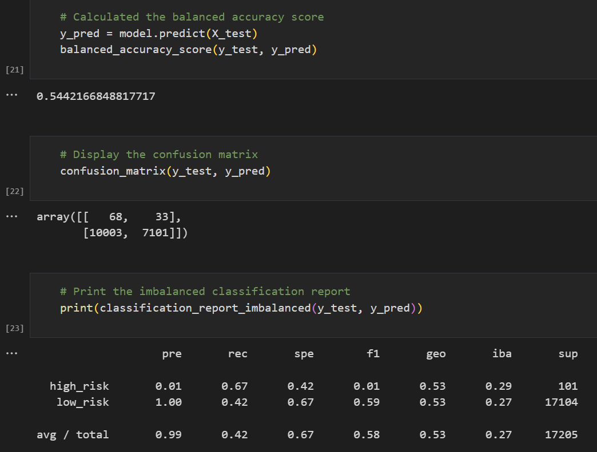
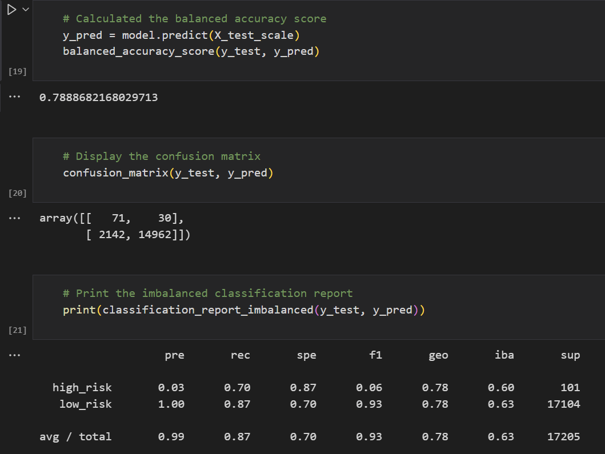

# Credit_Risk_Analysis
## Overview of the analysis 
In this analysis, we will use imbalanced-learn and scikit-learn libraries to build and evaluate models using resampling. The purpose is to assist a lending services company, LendingClub with analyzing credit card dataset. The RandomOverSampler and SMOTE algorithms are used to oversample the data to predict risk and the ClusterCentroids algorithm is used to undersample the data. Then we use the SMOTEENN algorithm to test a combination over- and under-sampling. Then, we trained and compared two different ensemble classifiers, BalancedRandomForestClassifier and EasyEnsembleClassifier, to predict credit risk and evaluate each model. 

## Results 
Resampling - RandomOverSampler

* The balanced accuracy score was 0.6640.
* The precision scores for high_risk and low_risk were 0.01 and 1.00.
* The recall scores for high_risk and low_risk were 0.71 and 0.62.

Resampling - SMOTE 

* The balanced accuracy score was 0.6556.
* The precision scores for high_risk and low_risk were 0.01 and 1.00.
* The recall scores for high_risk and low_risk were 0.63 and 0.68.

Resampling - ClusterCentroids

* The balanced accuracy score was 0.5442.
* The precision scores for high_risk and low_risk were 0.01 and 1.00.
* The recall scores for high_risk and low_risk were 0.67 and 0.42.

Resampling - SMOTEENN 

* The balanced accuracy score was 0.6823.
* The precision scores for high_risk and low_risk were 0.01 and 1.00.
* The recall scores for high_risk and low_risk were 0.77 and 0.59.

Ensemble - BalancedRandomForestClassifier 

* The balanced accuracy score was 0.7889.
* The precision scores for high_risk and low_risk were 0.03 and 1.00.
* The recall scores for high_risk and low_risk were 0.70 and 0.87.

Ensemble - EasyEnsembleClassifier  

* The balanced accuracy score was 0.9316.
* The precision scores for high_risk and low_risk were 0.09 and 1.00.
* The recall scores for high_risk and low_risk were 0.92 and 0.94.

## Summary 
Among the six machine learning algorithms we ran, the EasyEnsembleClassifier algorithm had the highest balanced accuracy score of 0.9316 and the highst precision score for high_risk. The precision scores for low_risk are the same score. 

Based on the above results, the model with the EasyEnsembleClassifer algorithm is recommended.

